# CTF Challenge Writeup

---

## 1. Classic Cipher

*This appears to be a basic classical cipher challenge.*

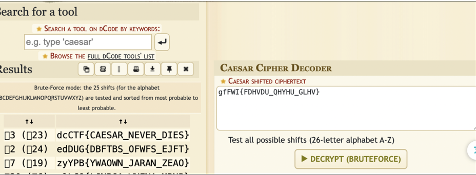

---

## 2. Oui Oui Secret

By brute-forcing, we get a nearly correct result.

Changing **B → L** in the key gives the correct output.

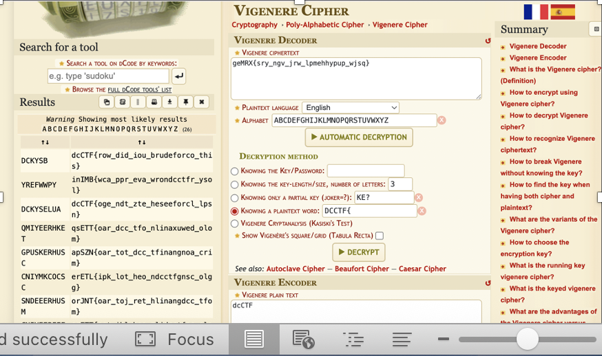

---

## 3. Fair Play

As the name suggests, it’s likely a **Playfair cipher**.

Brute-forcing the key eventually reveals the flag.

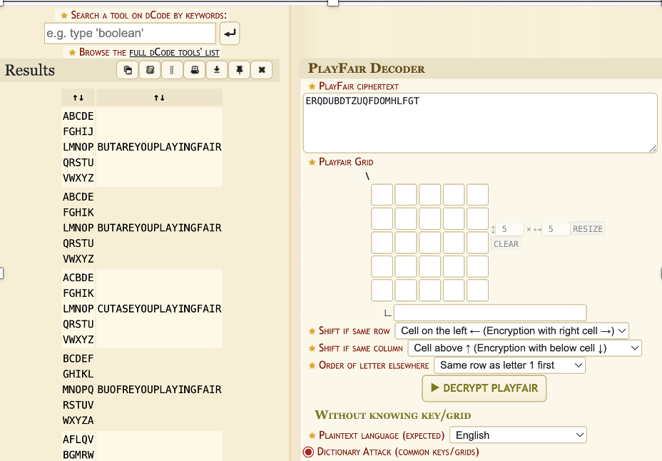

---

## 4. Weak RSA

Flag retrieved after decryption.

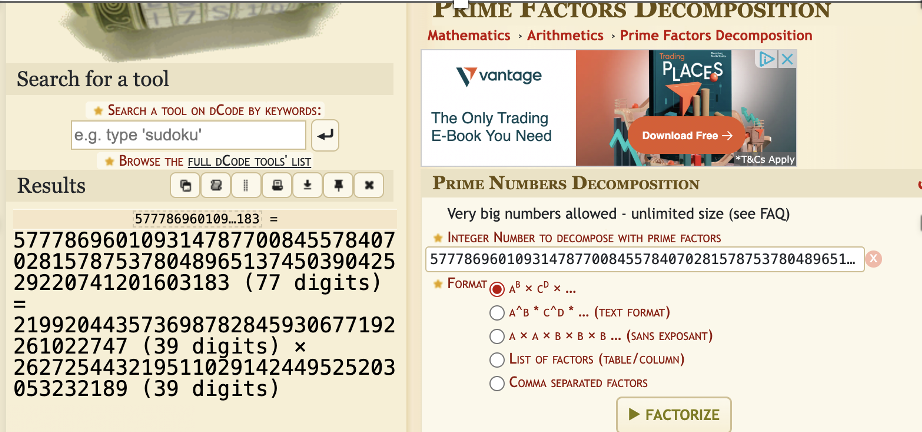
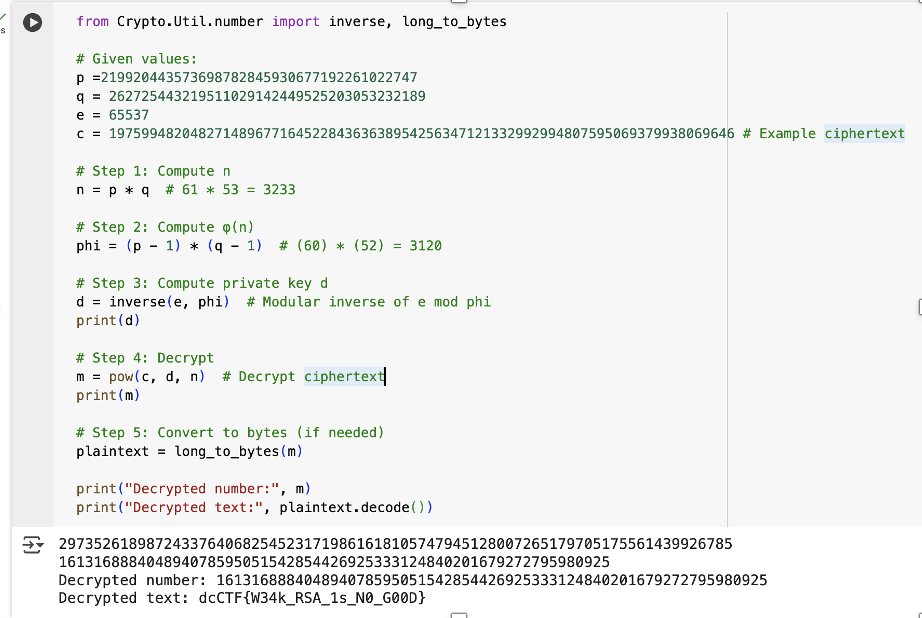

---

## 5. XOR Cipher

Looks like a **repeating-key XOR** encryption.

Key observed to repeat (like `"sand"`).

Decryption by XORing the ciphertext with the repeating key gives the flag.

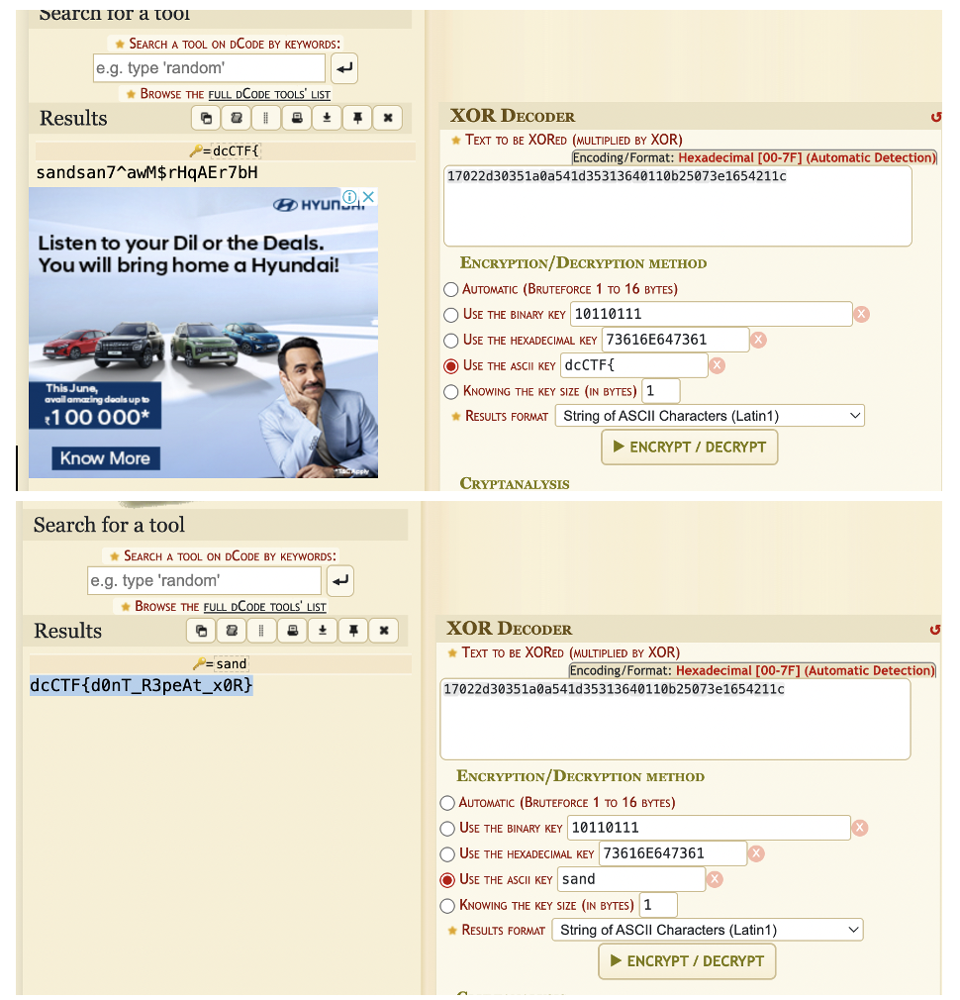

## 6. Chameleon image

Binwalk the file,gives that it is a zip file

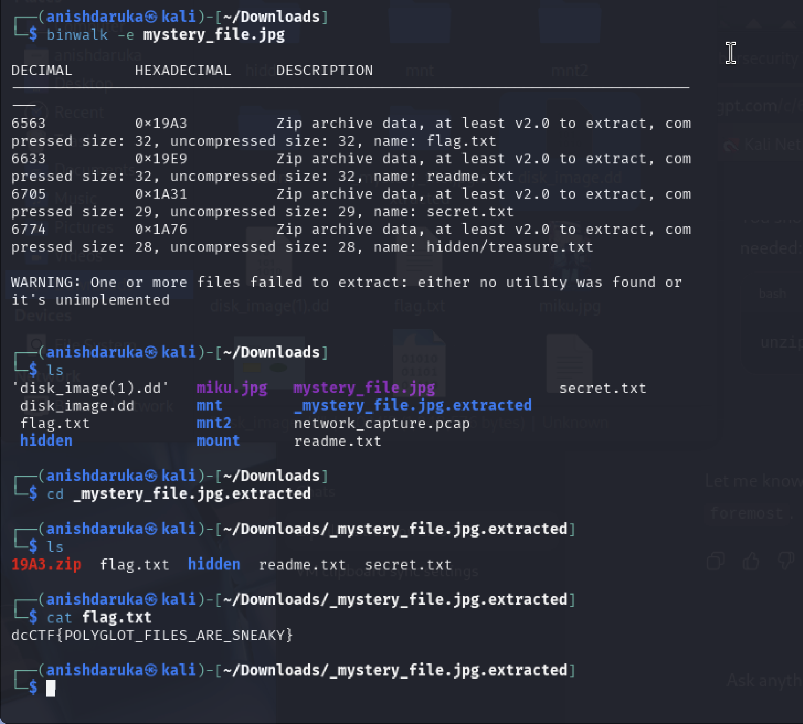

## 7. Sounds_of_secret

Audio steganogram suggests that it is a morse code

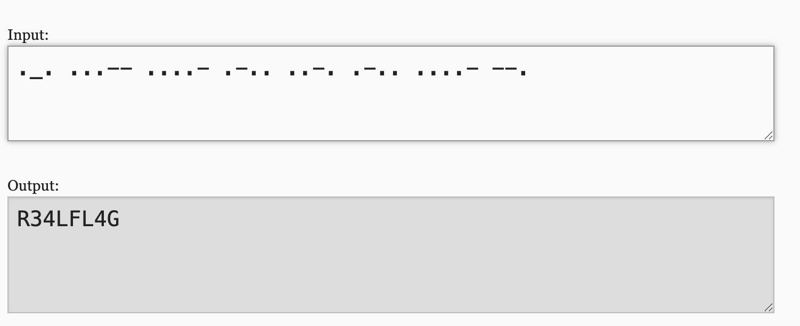

## 8. Chropped Antique

Extracting with pdfimages gives the full image

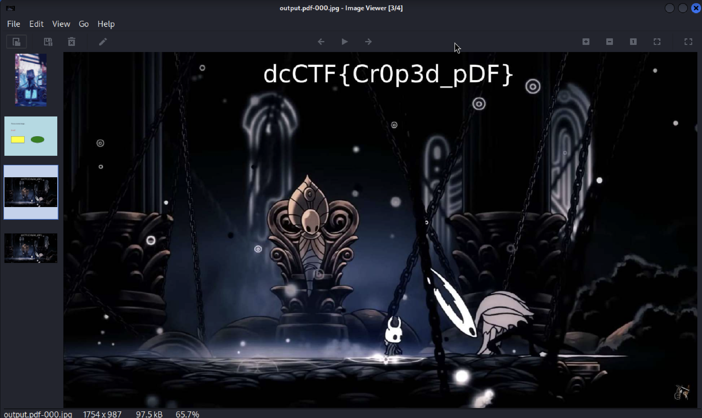

## 9. Evidence disk

scanning with foremost,reveals the flag

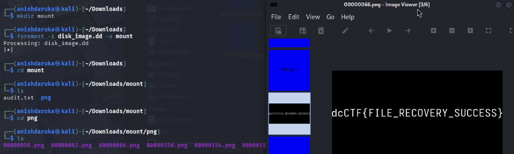

## 10. network intrusion

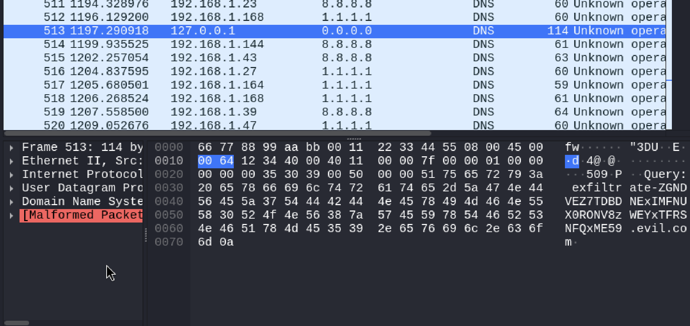

A msg was send from 127.0.0.0 to 0.0.0.0,decoding the msg gives the flag

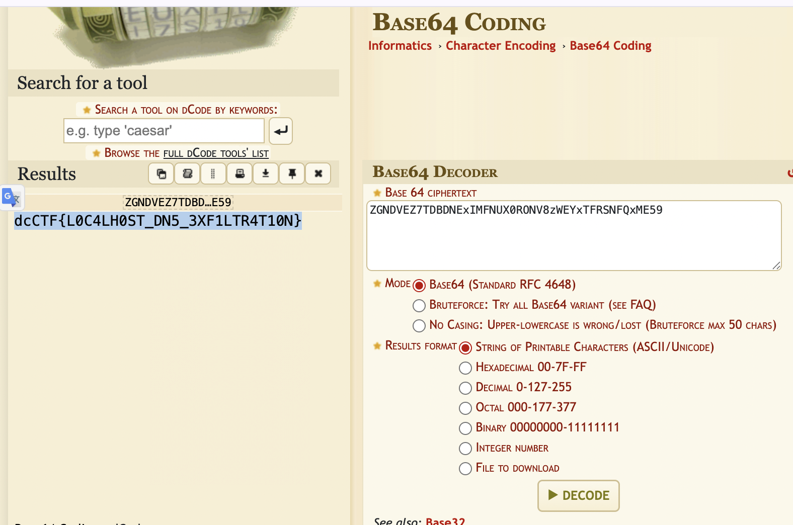